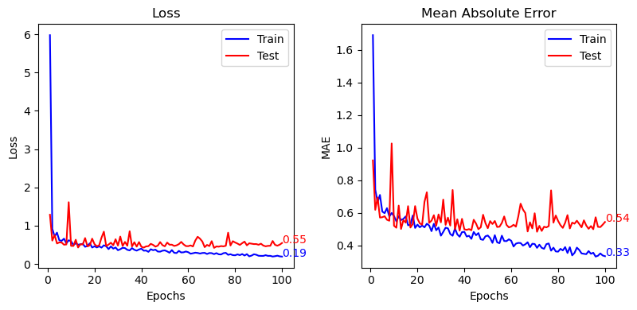

# Prédiction de la qualité du vin

Ce projet est inspiré d'un [TP Fidle](https://fidle.cnrs.fr/w3/). Il s'agit de prédire la qualité du vin à partir de ses caractéristiques chimiques.

## Données

Les datasets sont disponibles sur le site de l'[UCI](https://archive.ics.uci.edu/dataset/186/wine+quality). Ils contiennent 12 variables explicatives et une variable cible qui est la qualité du vin.

Les variables explicatives sont les suivantes:

- fixed acidity
- volatile acidity
- citric acid
- residual sugar
- chlorides
- free sulfur dioxide
- total sulfur dioxide
- density
- pH
- sulphates
- alcohol

La variable cible est la qualité du vin qui est une variable discrète comprise entre 0 et 10.

## Modèle

Le modèle utilisé est un modèle PyTorch. Il s'agit d'un réseau de neurones à 2 couches cachées. Le modèle est entrainé sur 80% des données et testé sur les 20% restants.

## Résultats

Le modèle obtient une erreur moyenne d'environ 0.5/10 sur les données de test.

